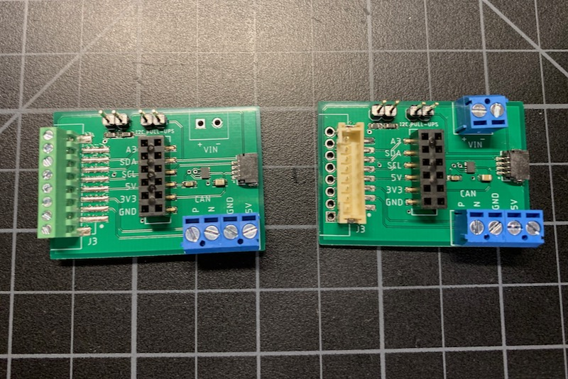
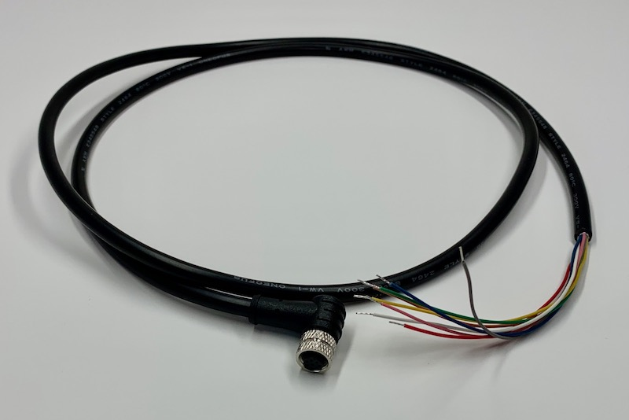
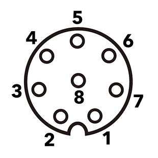
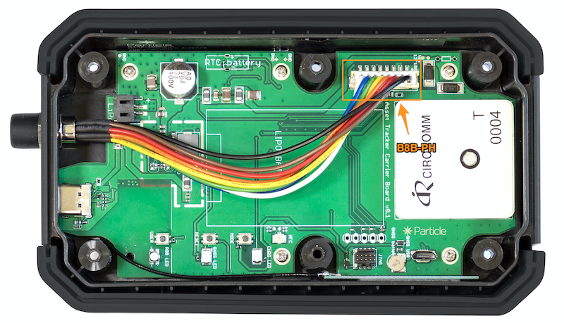
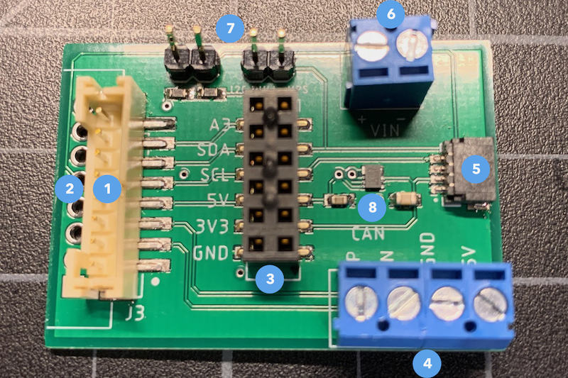
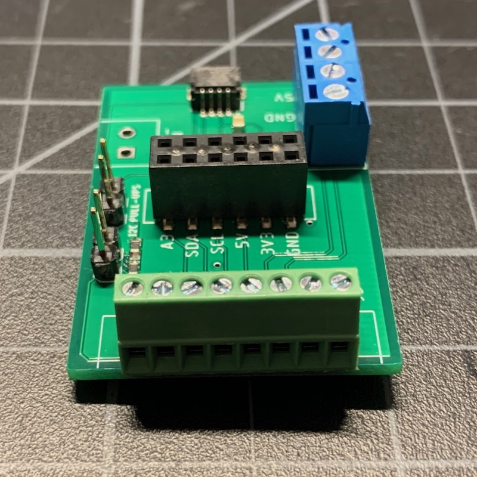
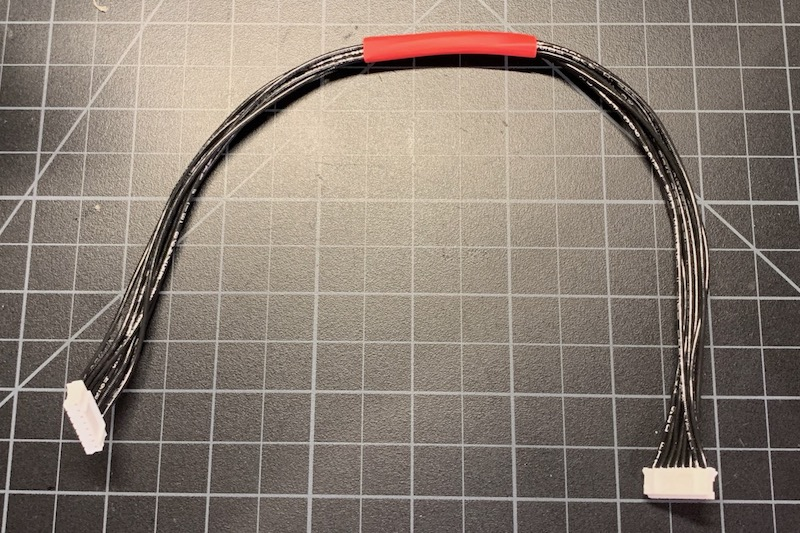
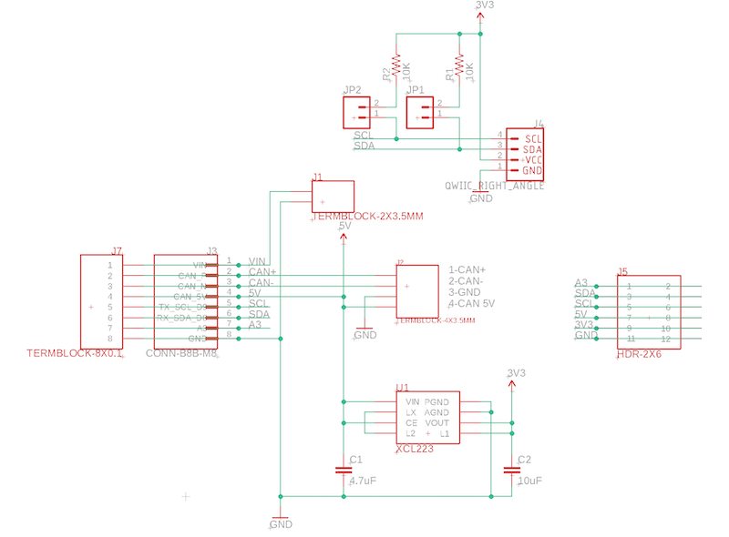
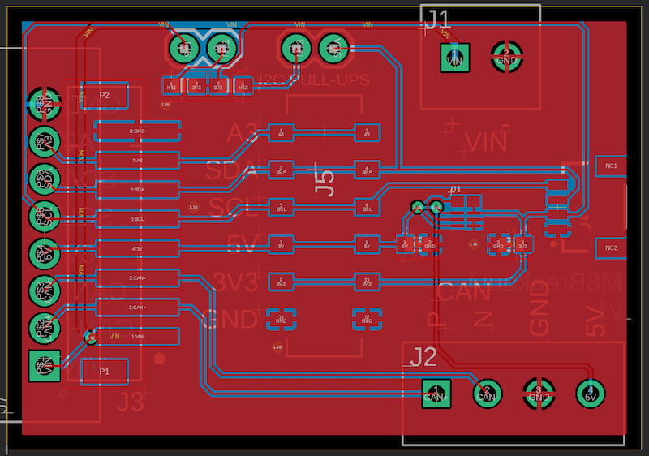
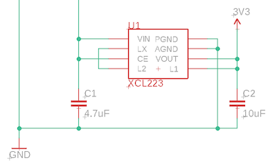

# AN015 Tracker Breakout

The full code examples for this application note can be found in the [Github repository](https://github.com/particle-iot/app-notes/tree/master/AN015-Tracker-Breakout) for this project.

## Expanding the Tracker One

### Using the M8 connector

The M8 (8mm) 8-pin connector is standard, however it's not common. Some other connectors like M12 are more common, however, the 12mm connector would have required a taller enclosure to fit the larger connector. To simplify designs, Particle will provide a M8 female-to-wires cable, similar to this. 

The color code and pin assignments for this cable are:

| PHR-8 Pin | M8 Pin | Function  | Color          |
| :-------- | :----- | :-------- | :------------- |
| 1         | 2      | VIN       | Red            |
| 2         | 1      | CAN_P     | Yellow         | 
| 3         | 7      | CAN_N     | Blue           | 
| 4         | 6      | CAN_5V    | Orange         | 
| 5         | 5      | TX_SCL_D9 | Brown          | 
| 6         | 4      | TX_SDA_D8 | Green          | 
| 7         | 3      | A3        | White          | 
| 8         | 8      | GND       | Black          | 

This is the view looking into the female M8 8-pin connector at the end of the M8 to flying leads cable. 

The common use case will be to include a cable gland in your expansion enclosure, pass the wires through the gland, and terminate them on your custom expansion board.

You'd typically connect those wires to your custom expansion board using one of several methods:

- Terminate with pins in a PHR-8 to mate with a B8B-PH on your expansion board
- Terminate with screw terminals on your board
- Terminate by soldering the wires to your board

### With the Tracker One Carrier Board directly

Inside the Tracker One is the Carrier Board. It can be purchased separately in case you want to use the Tracker One features in your own enclosure. The design for the Tracker One enclosure is open-source and can be modified to fit your needs. The Carrier Board has a B8B-PH 8-pin connector on the board, and a short cable that attaches to the M8 8-pin IP67 connector mounted on the side of the enclosure.

When expanding on the Tracker One Carrier Board, you may prefer to connect your expansion device to the B8B-PH connector on the board directly, especially if you are putting your expansion board in the enclosure with your Tracker One Carrier Board.

## Tracker One M8 Breakout Board

This is a simple design to help prototype expanding the Tracker One using the M8 port. It's a DIY project with Eagle CAD design files included; you currently cannot purchase a pre-built version of this. 

1. B8B-PH connector (optional)
2. Place for screw terminals or direct soldering of wires
3. Female header to connect prototyping wires
4. CAN bus screw terminal connector
5. Qwiic I2C connector (JST 4-pin 1mm)
6. VIN power input (4.5V to 30V DC)
7. I2C pull-up resistor jumpers (optional)
8. 3.3V power supply from CAN_5V (XCL224)

If you want to use the Tracker One M8 connector to your breakout board, one good option is to populate the breakout with a screw terminal header. Then you can use the M8 to flying wires cable shown above. This allows the Tracker One to remain sealed.

If you want to connect this directly to a Tracker One Carrier Board, the easiest solution is to build or purchase a PHR-8 to PHR-8 cable and populate the B8B-PH on your breakout board. This allows direct connection between the Tracker One Carrier Board and your board using an inexpensive cable.

| Quantity | Description | Example | Cost | 
| :---: | :--- | :--- | :--- | 
| 1 | CONN HOUSING PH 8POS 2MM WHITE | [JST PHR-8](https://www.digikey.com/product-detail/en/jst-sales-america-inc/PHR-8/455-1189-ND/608630) | $0.16 | 
| 8 | 12" 24 AWG leads with female | [JST ASPHSPH24K305](https://www.digikey.com/product-detail/en/jst-sales-america-inc/ASPHSPH24K305/455-3083-ND/6009459) |  $4.19 (10) |

A third option is to terminate the M8 to flying leads in a PHR-8 connector. This is useful if you'll be experimenting with several different boards because it's much faster to unplug the PHR-8 than mess with 8 screw terminals or even the M8 connector. 

| Quantity | Description | Example | Cost | 
| :---: | :--- | :--- | :--- | 
| 1 | CONN HOUSING PH 8POS 2MM WHITE | [JST PHR-8](https://www.digikey.com/product-detail/en/jst-sales-america-inc/PHR-8/455-1189-ND/608630) | $0.16 | 
| 8 | Crimp pins | [JST SPH-002T-P0.5S](https://www.digikey.com/product-detail/en/jst-sales-america-inc/SPH-002T-P0-5S/455-1127-1-ND/527358) |  $0.50 (10) |

If you are interested in prototyping designs intended to connect to the Tracker One M8 connector, but want to do it using the Tracker SoM Evaluation Board, you may be interested in [this project](https://github.com/rickkas7/M8-Eval-Adapter). It's only a set of design files, BoM, etc. and you'd need to fabricate the board and build it yourself; it's not available as a finished product. It has a B8B-PH connector which makes it easy to plug in your board using the PHR-8 to PHR-8 cable.

## Design Files

The design files for Eagle CAD are included in the **eagle** subdirectory. 

- M8Breakout4.sch - Schematic file
- M8Breakout4.brd - Board layout file
- M8Breakout4v1.zip - Gerber files
- M8-B8B-PH.dbl - Design block for B8B-PH/screw terminal combination

### Schematic

### Board Layout

### BoM (Bill of Materials)

| Quantity | Part | Description | Example | Cost | Note |
| :---: | :--- | :--- | :--- | ---: | :---: |
| 1 | C1 | Capacitor Ceramic 4.7uF 6.3V 0603 | [Murata GRM188R60J475KE19J](https://www.digikey.com/product-detail/en/murata-electronics-north-america/GRM188R60J475KE19J/490-6407-1-ND/3845604) | | 1 |
| 1 | C2 | Capacitor Ceramic 10uF 16V 0805 | [Murata GRM21BR61C106KE15L](https://www.digikey.com/product-detail/en/murata-electronics-north-america/GRM21BR61C106KE15L/490-3886-1-ND/965928) | | 1 |
| 2 | R1, R2 | Resistor 10K 5% 1/4W 0603 | [Panasonic ERJ-PA3J103V](https://www.digikey.com/product-detail/en/panasonic-electronic-components/ERJ-PA3J103V/P10KBZCT-ND/5036237) | |  7 |
| 1 | U1 | XCL224 3.3V regulator | [Torex XCL224A333D2-G](https://www.digikey.com/product-detail/en/torex-semiconductor-ltd/XCL224A333D2-G/893-1419-1-ND/8256121) |$ 2.43|  1 |
| 1 | J1 | TERMBLOCK-2X3.5MM | [On Shore OSTTE020161](https://www.digikey.com/products/en?keywords=ED2635-ND) | $0.67 | 3 |
| 1 | J2 | TERMBLOCK-4X3.5MM | [On Shore OSTTE040161](https://www.digikey.com/product-detail/en/on-shore-technology-inc/OSTTE040161/ED2637-ND/614586) | $1.01 | 4 |
| 1 | J3 | Conn SMD 8 position 2.00mm | [JST B8B-PH-SM4-TB(LF)(SN)](https://www.digikey.com/product-detail/en/jst-sales-america-inc/B8B-PH-SM4-TB-LF-SN/455-1740-1-ND/926837) | $1.00 | 5 |
| 1 | J4 | QWIIC JST 4-pin 1mm | [Sparkfun](https://www.sparkfun.com/products/14417) | $0.50 | 2 |
| 1 | J5 | 6x2 female header SMD | [Sullins NPPC062KFMS-RC](https://www.digikey.com/product-detail/en/sullins-connector-solutions/NPPC062KFMS-RC/S5715-ND/776174) | $1.75 |  |
| 1 | J7 | Term Block 8x0.1" PTH | [On Shore OSTVN08A150](https://www.digikey.com/product-detail/en/on-shore-technology-inc/OSTVN08A150/ED10566-ND/1588868) | $2.36 | 6 |
| 2 | | Shorting jumper 2x1 0.1" | [Hirose](https://www.digikey.com/product-detail/en/sullins-connector-solutions/QPC02SXGN-RC/S9337-ND/2618262) | $0.13 | 5 |
| 2 | | Male header pins 0.1" | [Sullins PRPC040SAAN-RC](https://www.digikey.com/product-detail/en/PRPC040SAAN-RC/S1011EC-40-ND/2775214) | | 5 |

Choose one of:

| Quantity | Part | Description | Example | Cost | 
| :---: | :--- | :--- | :--- | ---: | 
| 1 | J3 | Conn SMD 8 position 2.00mm | [JST B8B-PH-SM4-TB(LF)(SN)](https://www.digikey.com/product-detail/en/jst-sales-america-inc/B8B-PH-SM4-TB-LF-SN/455-1740-1-ND/926837) | $1.00 | 
|   | J7 | Male Header Pins (8x0.1") | [Sullins PRPC040SAAN-RC](https://www.digikey.com/product-detail/en/PRPC040SAAN-RC/S1011EC-40-ND/2775214) | |
| 1 | J7 | Screw Terminal Block 8x0.1" PTH | [On Shore OSTVN08A150](https://www.digikey.com/product-detail/en/on-shore-technology-inc/OSTVN08A150/ED10566-ND/1588868) | $2.36 |

Notes:

- (1) DNP if the 3.3V power supply is not desired. You cannot use the Qwiic I2C connector without 3.3V!
- (2) DNP if the Qwiic I2C connector is not needed.
- (3) DNP if power in (VIN) is not required.
- (4) DNP if CAN BUS is not required.
- (5) DNP if not using I2C pull-ups. They are not needed if using Qwiic or serial.
- DNP = Do not populate, omit this component.

### Regulator

The M8 connector supplies 5V at 400 mA, and can be turned on and off using the `CAN_PWR` GPIO. There is a boost converter on the Tracker SoM and 5V is available off battery as well as USB and external VIN power.

Since the nRF52840 MCU only supports 3.3V logic levels on I2C, Serial, and GPIO, a 3.3V regulator is often required. This design uses a Torex XCL223 or XCL224. It's tiny, inexpensive, and does not require an external inductor, which saves space and BoM costs. It's a 700 mA regulator, but you'll be limited to the 400 mA on CAN_5V.

## Using Qwiic (I2C)

One convenient way to connect sensors is using I2C, the Inter-Integrated Circuit bus also known as I2C, pronounced "eye squared see," or sometimes IIC. This bus uses two bi-directional data lines (SDA and SCL), and often includes power (often 3.3V) and ground.

Sparkfun has created a whole line of accessories including:

- Environment sensors (pressure, temperature, humidity) like the BME280
- Buttons and indicator buttons
- Load cell adapter (weight sensor)
- Distance and proximity sensors
- Thermocouple adapters
- Relays
- Keypads
- Small displays

Each of the devices is a small board with two Qwiic connectors, tiny JST 1mm-pitch 4-pin connectors. The connector is keyed so you don't need to worry about connecting it backwards, and the devices can be daisy-chained, one after the other. They're intended to be used over relatively small distances, under a meter, though there is also long-distance differential version that requires more wires.

Learn more about the Qwiic system and libraries [here](https://docs.particle.io/community/qwiic/).

This can be an easy way to prototype new sensor designs, even if you eventually plan to build your own custom sensor board. The M8 breakout board here has a Qwiic connector for easy prototyping. 

